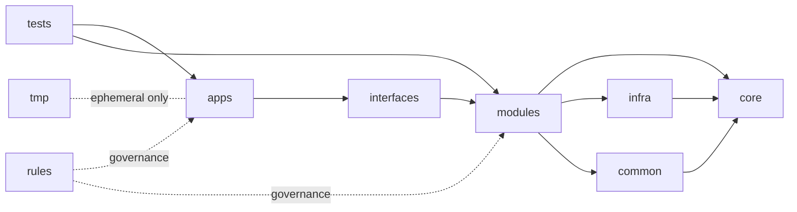

# 通用锚点：folder_structure（目录结构合同，细粒度版）

anchor_id: `common_folder_structure`
category: `common`
mol_resident_source:
- `assets/goal/MOL_FULL_CANON.md`
graph_hook:
- graph_doc: `references/knowledge_graph/MOL_TECH_STACK_KEYWORD_ANCHOR_GRAPH_v1.md`
- graph_node: `common_always_on`

## 在项目中起什么作用
- 提供可直接落地的工程目录标准，避免“目录过粗 + 代码堆叠”。
- 将目录治理与 `common_fat_file`、`common_file_structure` 绑定，确保超阈值能有固定拆分落点。
- 明确 `core/common/tmp` 等关键目录角色，保证工程整洁可持续。

## 适用范围（必须全覆盖）

| 维度 | 受约束对象 |
|---|---|
| `service_layout` | 服务/运行时主目录组织 |
| `domain_layout` | feature 级目录与职责边界 |
| `shared_layout` | core/common/helpers 等公共能力目录 |
| `temporary_layout` | tmp/cache/artifacts 等临时目录 |
| `rule_layout` | lint/policy/constitution 规则目录 |

## 写法风格（命令式）
- 先写目录职责，再写允许内容，再写禁止内容。
- 每条目录规则都必须可由扫描命令验证。
- 目录命名必须语义稳定，禁止临时命名。

## 标准目录矩阵（强制）

| 目录 | 允许内容 | 禁止内容 |
|---|---|---|
| `core/` | 核心领域模型、协议、稳定抽象 | 页面代码、临时脚本 |
| `common/` | 公共工具、通用中间件、shared helper | 业务专属流程 |
| `apps/` | 可运行应用入口（api/web/admin/worker） | 通用库实现 |
| `modules/` | feature 业务模块（按能力拆分） | 跨域杂糅逻辑 |
| `infra/` | DB、queue、external adapter、io 封装 | 领域业务决策 |
| `interfaces/` | controller、route、dto、transport 映射 | 持久化细节 |
| `config/` | 配置模板与环境映射 | 业务流程代码 |
| `scripts/` | 工具脚本与任务入口 | 核心业务逻辑 |
| `tests/` | unit/integration/e2e | 生产运行代码 |
| `logs/` | 结构化日志落盘目录（固定锚点 `<codebase>/logs/`） | 任意业务源码、临时草稿 |
| `rules/` | lint/policy/constitution 定义文件 | 业务执行代码 |
| `tmp/` | 临时产物、一次性缓存、中间件输出 | 长期资产、源码 |
| `docs/` | 规范文档、设计文档、运行手册 | 可执行生产逻辑 |

## 目录架构示意图（Canonical Tree）

```text
project-root/
├── apps/
│   ├── api/
│   ├── web/
│   ├── admin/
│   └── worker/
├── core/
│   ├── domain/
│   ├── contracts/
│   └── policies/
├── common/
│   ├── helpers/
│   ├── middleware/
│   ├── utils/
│   └── observability/
├── modules/
│   └── <feature>/
│       ├── <feature>_controller.py
│       ├── <feature>_orchestrator.py
│       ├── <feature>_domain.py
│       ├── <feature>_repo.py
│       ├── <feature>_adapter_<target>.py
│       └── <feature>_helper.py
├── infra/
│   ├── db/
│   ├── cache/
│   ├── queue/
│   └── external/
├── interfaces/
│   ├── http/
│   ├── telegram/
│   └── cli/
├── config/
├── scripts/
├── tests/
│   ├── unit/
│   ├── integration/
│   └── e2e/
├── logs/
│   ├── ledger/
│   ├── audit/
│   ├── app/
│   ├── trace_sampled/
│   ├── dead_letter/
│   └── _meta/
├── rules/
│   ├── lint/
│   ├── policy/
│   └── constitution/
├── docs/
└── tmp/
    ├── cache/
    ├── exports/
    └── scratch/
```

## 依赖方向示意图（Architecture）



## 与阈值治理联动规则（强制）

1. 文件行数上限以 `common_fat_file` 为唯一来源。
2. 超阈值拆分路径以 `common_file_structure` 固定模板为唯一来源。
3. 目录结构必须给阈值拆分提供落点，不得出现“超限但无目录归属”。
4. `rules/` 中规则文件允许至 `1000` 行，仅限规则定义；超过则按子域拆分。
5. `tmp/` 仅允许临时产物，禁止长期保留可执行源代码。

## 扩展合同（按需）
- `archive_root`: 冷数据归档目录与保留策略。
- `sandbox_root`: 实验运行目录与清理策略。
- `shared_assets`: 跨应用静态资产目录约束。
- `owner_map`: 主目录责任归属映射。

## 目录治理合同（Project Required）

| 项 | 规则 |
|---|---|
| `root_layout` | 主目录必须符合标准矩阵 |
| `content_policy` | 每个目录只允许放置指定内容 |
| `forbidden_policy` | 禁放内容命中即判定违规 |
| `dependency_direction` | 依赖方向必须符合架构示意图 |
| `tmp_policy` | `tmp/` 禁止长期源码与核心资产 |
| `logs_policy` | `logs/` 只允许结构化日志产物，禁止源码与规则文件 |

## 必须做（Do）
1. 新模块创建时先落目录，再写文件。
2. 业务逻辑优先进入 `modules/<feature>/`，不要散落到 `common/`。
3. 核心抽象只放 `core/`，并保持稳定接口。
4. 公共 helper 放 `common/helpers/`，并保持纯函数倾向。
5. 定期清理 `tmp/`，禁止临时产物进入主链路提交。
6. 目录重构后同步更新导入路径、构建脚本和文档索引。

## 不要做（Don't）
1. 不要把 feature 逻辑直接塞进 `apps/` 入口层。
2. 不要在 `common/` 堆放业务专属代码。
3. 不要让 `infra/` 反向依赖 `modules/` 业务实现。
4. 不要把 `tmp/` 当永久缓存目录。
5. 不要新增“misc/other/new_folder2”这类语义不明目录。

## 为什么（Why）
1. 细粒度目录可直接承接你要求的小职责拆分。
2. `core/common/modules` 分离后，复用与演进成本最低。
3. `tmp` 明确隔离能避免脏产物污染主线。
4. 依赖方向固定可降低循环依赖和回归爆炸风险。

## 实操命令（项目级）
```bash
# 1) 目录结构巡检（是否具备标准主目录）
find . -maxdepth 2 -type d | rg -n "^(\\./)?(apps|core|common|modules|infra|interfaces|config|scripts|tests|logs|rules|docs|tmp)$"

# 2) tmp 污染检查（tmp 下不允许源码）
find tmp -type f \( -name "*.py" -o -name "*.ts" -o -name "*.vue" -o -name "*.go" \) 2>/dev/null

# 3) rules 上限检查（>1000 失败）
find rules -type f \( -name "*.md" -o -name "*.yaml" -o -name "*.yml" \) -print0 2>/dev/null | \
  xargs -0 wc -l | awk '$1>1000{print;bad=1} END{exit bad}'

# 4) 本条款反查
rg -n "common_folder_structure|common_fat_file|common_file_structure" references/anchor_docs/common references/anchor_docs/ANCHOR_DOC_REGISTRY.yaml
```

## 最小验收
1. 工程目录包含 `core/common/modules/tmp` 等关键层并角色清晰。
2. 超阈值文件可按固定目录模板拆分落地。
3. `tmp/` 不含长期源码与核心资产。
4. `rules/` 文件满足 1000 行上限且仅规则定义。
